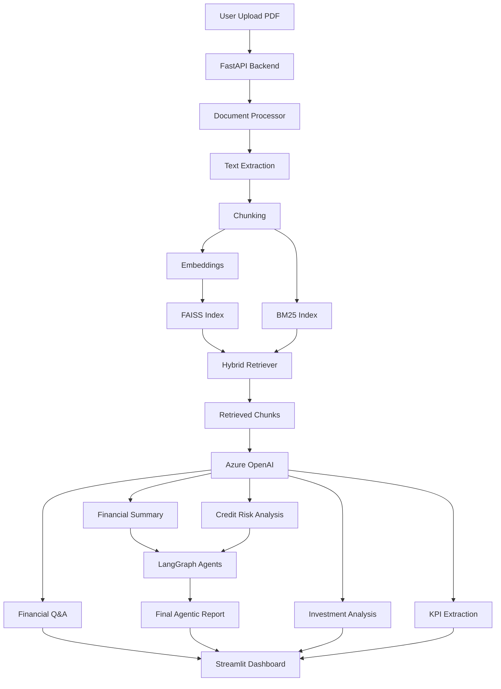

# FinSight AI – Financial Intelligence Copilot

FinSight AI is an AI-powered Financial Intelligence Copilot designed for analysts, bankers, auditors, fintech teams, NBFCs, and credit risk teams.

It processes annual reports and financial documents, performs Hybrid RAG-based retrieval, answers financial questions, generates analyst-style summaries, extracts KPIs, assesses credit risk, and generates investment insights using Azure OpenAI and LangGraph.

---

## Key Features

### Document Intelligence

* PDF Upload
* Text Extraction using PyMuPDF
* Smart Chunking
* Financial Document Indexing

### Hybrid RAG Pipeline

* Sentence Transformers Embeddings
* FAISS Semantic Search
* BM25 Keyword Search
* Hybrid Retrieval
* Source Citations

### AI Capabilities

* Financial Q&A
* Financial Summary Generation
* Credit Risk Analysis
* Investment Recommendation
* KPI Extraction

### Agentic AI

* LangGraph Multi-Agent Workflow
* Retrieval Agent
* Financial Summary Agent
* Credit Risk Agent
* Final Analyst Agent

### Dashboard

* Upload Document
* Chat with Document
* Financial Summary
* KPI Dashboard
* Credit Risk
* Agentic Report
* Investment Analysis

---

# Architecture
# RAG Pipeline



---

# LangGraph Workflow


---

# Tech Stack

| Layer          | Technology               |
| -------------- | ------------------------ |
| Frontend       | Streamlit                |
| Backend        | FastAPI                  |
| LLM            | Azure OpenAI GPT-4o-mini |
| RAG            | FAISS + BM25             |
| Embeddings     | Sentence Transformers    |
| Agents         | LangGraph                |
| PDF Processing | PyMuPDF                  |
| Language       | Python                   |

---
# Docker Deployment

## Prerequisites

* Docker Desktop
* Docker Compose

Verify installation:

```bash
docker --version
docker compose version
```

---

## Clone Repository

```bash
git clone https://github.com/VivekMane57/finsight-ai.git
cd finsight-ai
```

---

## Configure Environment Variables

Create a `.env` file in the project root.

```env
AZURE_OPENAI_API_KEY=YOUR_API_KEY
AZURE_OPENAI_ENDPOINT=YOUR_ENDPOINT
AZURE_OPENAI_API_VERSION=2024-02-15-preview
AZURE_OPENAI_DEPLOYMENT=YOUR_DEPLOYMENT_NAME
```

---

## Build Containers

```bash
docker compose build --no-cache
```

---

## Run Application

```bash
docker compose up
```

Run in background:

```bash
docker compose up -d
```

---

## Access Application

### Streamlit Frontend

```text
http://localhost:8501
```

### FastAPI Swagger Documentation

```text
http://localhost:8000/docs
```

---

## Stop Containers

```bash
docker compose down
```

---

## Docker Architecture

```text
┌─────────────────────┐
│   Streamlit UI      │
│    Port : 8501      │
└──────────┬──────────┘
           │
           ▼
┌─────────────────────┐
│   FastAPI Backend   │
│    Port : 8000      │
└──────────┬──────────┘
           │
           ▼
┌─────────────────────┐
│  Hybrid Retrieval   │
│   FAISS + BM25      │
└──────────┬──────────┘
           │
           ▼
┌─────────────────────┐
│ Azure OpenAI LLM    │
└─────────────────────┘
```

---

## Features

* Financial Document Upload
* Hybrid RAG (FAISS + BM25)
* Financial Q&A
* Financial Summary Generation
* KPI Dashboard
* Credit Risk Analysis
* Investment Analysis
* LangGraph Agentic Workflow
* Dockerized Deployment
* Azure OpenAI Integration

---

## Tech Stack

### Backend

* FastAPI
* Python
* Azure OpenAI
* LangGraph

### Retrieval

* FAISS
* BM25
* Scikit-Learn

### Frontend

* Streamlit

### Deployment

* Docker
* Docker Compose


# Project Structure

```text
finsight-ai/

backend/
│
├── api/
│   ├── documents.py
│   ├── chat.py
│   ├── analysis.py
│   ├── kpi.py
│   ├── agents.py
│   └── investment.py
│
├── services/
│   ├── document_processor.py
│   ├── chunking.py
│   ├── embedding_service.py
│   ├── faiss_store.py
│   ├── bm25_store.py
│   ├── search_service.py
│   └── llm_service.py
│
├── agents/
│   ├── financial_graph.py
│   └── investment_agent.py
│
└── main.py

frontend/
└── app.py

uploads/
vectorstore/

README.md
requirements.txt
```

---

# API Endpoints

### Upload Document

POST /documents/upload

### Financial Q&A

POST /chat/query

### Financial Summary

POST /analysis/financial-summary

### Credit Risk Analysis

POST /analysis/credit-risk

### KPI Extraction

GET /kpi/financial-kpis

### Agentic Report

POST /agents/financial-intelligence

### Investment Analysis

POST /analysis/investment-analysis

---

# Installation

## Clone Repository

```bash
git clone https://github.com/VivekMane57/finsight-ai.git
cd finsight-ai
```

## Create Virtual Environment

```bash
python -m venv venv
```

Windows:

```bash
venv\Scripts\activate
```

## Install Dependencies

```bash
pip install -r requirements.txt
```

## Create .env

```env
AZURE_OPENAI_API_KEY=your_key
AZURE_OPENAI_ENDPOINT=your_endpoint
AZURE_OPENAI_DEPLOYMENT=gpt-4o-mini
AZURE_OPENAI_API_VERSION=2024-02-15-preview
```

---

# Run Backend

```bash
uvicorn backend.app.main:app --reload
```

Swagger:

```text
http://127.0.0.1:8000/docs
```

---

# Run Frontend

```bash
python -m streamlit run frontend/app.py
```

---

# Resume Highlights

* Built FinSight AI, an Agentic Financial Intelligence Copilot using FastAPI, Streamlit, Azure OpenAI, LangGraph, FAISS, BM25, and Sentence Transformers.
* Implemented Hybrid RAG combining FAISS semantic retrieval and BM25 keyword search.
* Developed Financial Summary, Credit Risk, KPI Extraction, and Investment Analysis agents.
* Built LangGraph multi-agent workflow with Retrieval Agent, Summary Agent, Credit Risk Agent, and Final Analyst Agent.
* Designed an end-to-end AI application with document upload, source-grounded Q&A, KPI dashboards, and financial analysis.

---

# Current Status

| Module            | Status |
| ----------------- | ------ |
| PDF Upload        | ✅      |
| Text Extraction   | ✅      |
| FAISS Retrieval   | ✅      |
| BM25 Retrieval    | ✅      |
| Hybrid RAG        | ✅      |
| Azure OpenAI      | ✅      |
| Source Citations  | ✅      |
| Financial Summary | ✅      |
| KPI Dashboard     | ✅      |
| Credit Risk Agent | ✅      |
| LangGraph Agents  | ✅      |
| Investment Agent  | ✅      |

---

# Future Improvements

* PostgreSQL Integration
* JWT Authentication
* Chat History
* PDF Report Export
* Docker Deployment
* Multi-Company Comparison
* Fraud Detection Agent

---

# Disclaimer

This project is for educational and portfolio purposes only and does not provide financial advice.
