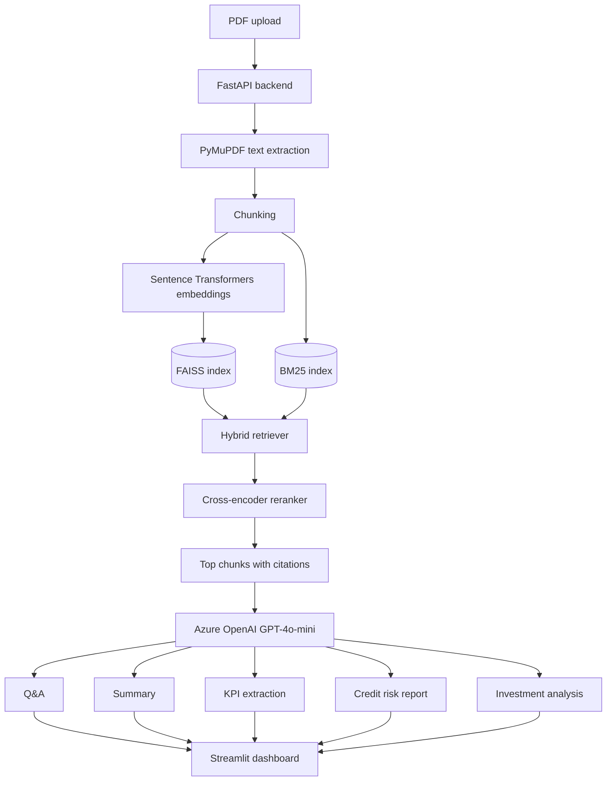
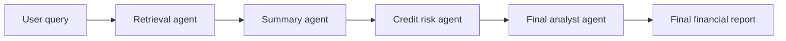
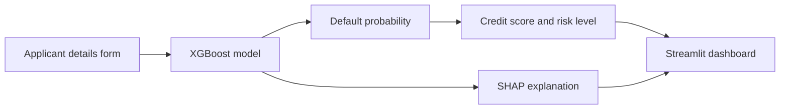

# FinSight AI: Financial Intelligence Copilot


FinSight AI reads annual reports and other financial PDFs, answers questions with source citations, extracts KPIs, and produces analyst-style reports. It also includes a separate machine-learning credit-risk predictor with SHAP explanations. It is built for analysts, bankers, auditors, NBFCs and credit-risk teams who need answers they can trace back to a source.

## Demo

https://github.com/user-attachments/assets/fd5e49ce-0fd8-449d-a88a-6fe1d004b5cf

## What it does

| Dashboard tab | How it works |
| --- | --- |
| Chat with Document | Hybrid retrieval (FAISS + BM25) with cross-encoder reranking and source citations |
| Financial Summary | LLM summary over retrieved sections of the report |
| KPI Dashboard | Pulls key ratios and figures into a dashboard |
| Credit Risk | Lender-style credit risk report for the uploaded annual report, written by the LLM from retrieved evidence |
| Agentic Report | LangGraph workflow that chains retrieval, summary, credit risk and a final analyst step |
| Investment Analysis | LLM analysis built on the retrieved evidence |
| LLM Evaluation | Custom RAG metrics, RAGAS and LLM-as-judge on a query of your choice |
| ML Credit Risk | XGBoost model that predicts default probability, credit score and risk level from applicant details, with SHAP explanations |

## Architecture

### Document pipeline (RAG)


```mermaid
flowchart TD
    A[PDF upload] --> B[FastAPI backend]
    B --> C[PyMuPDF text extraction]
    C --> D[Chunking]
    D --> E[Sentence Transformers embeddings]
    E --> F[(FAISS index)]
    D --> G[(BM25 index)]
    F --> H[Hybrid retriever]
    G --> H
    H --> I[Cross-encoder reranker]
    I --> J[Top chunks with citations]
    J --> K[Azure OpenAI GPT-4o-mini]
    K --> L[Q&A]
    K --> M[Summary]
    K --> N[KPI extraction]
    K --> O[Credit risk report]
    K --> P[Investment analysis]
    L --> R[Streamlit dashboard]
    M --> R
    N --> R
    O --> R
    P --> R
```

### LangGraph agent workflow


```mermaid
flowchart LR
    A[User query] --> B[Retrieval agent]
    B --> C[Summary agent]
    C --> D[Credit risk agent]
    D --> E[Final analyst agent]
    E --> F[Final financial report]
```

### ML credit-risk predictor (separate from the document pipeline)


```mermaid
flowchart LR
    A[Applicant details form] --> B[XGBoost model]
    B --> C[Default probability]
    C --> D[Credit score and risk level]
    B --> E[SHAP explanation]
    D --> F[Streamlit dashboard]
    E --> F
```

## Design decisions

**Why hybrid retrieval.** Financial documents mix meaning-based questions ("what does the company say about liquidity risk?") with exact-term lookups ("Gross NPA ratio", a specific year). Dense search handles the first well and blurs the second. BM25 covers exact terms, so the two are combined.

**Why a reranker.** The retriever returns a broad candidate set. A cross-encoder rescoring the query and each chunk together puts the most relevant chunks first before they reach the LLM.

**Why a separate ML model next to the LLM.** An LLM can describe risk but cannot show which inputs drove a score, and its numbers can change between runs. The XGBoost model returns a repeatable default probability, and SHAP shows which features pushed it up or down, so a reviewer can check the reasoning.

## ML credit risk

The ML Credit Risk tab takes applicant details (for example savings and checking account status, job level, loan duration and loan purpose) and returns a default probability, a credit score and a risk level. The Explain with SHAP button shows which features drove the prediction.

Example output from the demo:

```json
{
  "credit_score": 94,
  "default_probability": 0.056,
  "risk_prediction": 0,
  "risk_level": "LOW"
}
```

This model is a demonstration on a public-style tabular credit dataset and must not be used for real lending decisions. In production lending, protected attributes such as sex cannot be used as model inputs.

## Evaluation

The LLM Evaluation tab runs three checks on any query: custom RAG metrics, RAGAS, and an LLM-as-judge. LangSmith is used for tracing.

Example run (single query: "What are the major business risks?", on the sample document used in the demo):

| Check | Metric | Result |
| --- | --- | --- |
| Custom RAG metrics | Context relevance | 0.75 |
| Custom RAG metrics | Citation score | 1.0 |
| Custom RAG metrics | Completeness | 1.0 |
| Custom RAG metrics | Overall RAG score | 0.887 |
| Custom RAG metrics | Latency | 3.78 s |
| LLM-as-judge | Faithfulness | 1.0 |
| LLM-as-judge | Relevance | 1.0 |
| LLM-as-judge | Citation quality | 1.0 |
| LLM-as-judge | Completeness | 1.0 |

These figures come from one query on one document. They show what the evaluation tab reports, not a benchmark. A multi-question evaluation is on the roadmap.

## Tech stack

| Layer | Technology |
| --- | --- |
| Frontend | Streamlit |
| Backend | FastAPI, Python 3.11 |
| LLM | Azure OpenAI GPT-4o-mini |
| Retrieval | FAISS, BM25, Sentence Transformers, cross-encoder reranker |
| Agents | LangGraph |
| Credit risk | XGBoost, SHAP, Scikit-Learn |
| Evaluation | RAGAS, LangSmith, LLM-as-judge |
| PDF processing | PyMuPDF |
| Deployment | Docker, Docker Compose |

## Quick start

### Option 1: Docker

```bash
git clone https://github.com/VivekMane57/finsight-ai.git
cd finsight-ai
```

Create a `.env` file in the project root:

```env
AZURE_OPENAI_API_KEY=your_key
AZURE_OPENAI_ENDPOINT=your_endpoint
AZURE_OPENAI_API_VERSION=2024-02-15-preview
AZURE_OPENAI_DEPLOYMENT=your_deployment_name
```

Build and run:

```bash
docker compose build --no-cache
docker compose up
```

- Frontend: http://localhost:8501
- API docs (Swagger): http://localhost:8000/docs

Stop with `docker compose down`.

### Option 2: Local

```bash
python -m venv venv
venv\Scripts\activate        # Windows
# source venv/bin/activate   # macOS / Linux
pip install -r requirements.txt
```

Add the same `.env` file, then run the backend and frontend in two terminals:

```bash
uvicorn backend.app.main:app --reload
```

```bash
python -m streamlit run frontend/app.py
```

## API endpoints

| Method | Endpoint | Purpose |
| --- | --- | --- |
| POST | `/documents/upload` | Upload and index a document |
| POST | `/chat/query` | Source-grounded financial Q&A |
| POST | `/analysis/financial-summary` | Financial summary |
| POST | `/analysis/credit-risk` | Credit risk report |
| GET | `/kpi/financial-kpis` | KPI extraction |
| POST | `/agents/financial-intelligence` | Full agentic report |
| POST | `/analysis/investment-analysis` | Investment analysis |

## Project structure

```text
finsight-ai/
├── backend/
│   └── app/
│       ├── api/
│       │   ├── documents.py
│       │   ├── chat.py
│       │   ├── analysis.py
│       │   ├── kpi.py
│       │   ├── agents.py
│       │   └── investment.py
│       ├── services/
│       │   ├── document_processor.py
│       │   ├── chunking.py
│       │   ├── embedding_service.py
│       │   ├── faiss_store.py
│       │   ├── bm25_store.py
│       │   ├── search_service.py
│       │   └── llm_service.py
│       ├── agents/
│       │   ├── financial_graph.py
│       │   └── investment_agent.py
│       └── main.py
├── frontend/
│   └── app.py
├── uploads/
├── vectorstore/
├── Dockerfile
├── docker-compose.yml
├── requirements.txt
└── README.md
```

## Roadmap

- Multi-question evaluation benchmark on public annual reports
- Full RAGAS metrics (context precision and recall with reference answers)
- PostgreSQL for persistent storage
- JWT authentication
- Chat history
- PDF report export
- Multi-company comparison
- Fraud detection agent

## Disclaimer

This project is for educational and portfolio purposes only. It does not provide financial advice.
