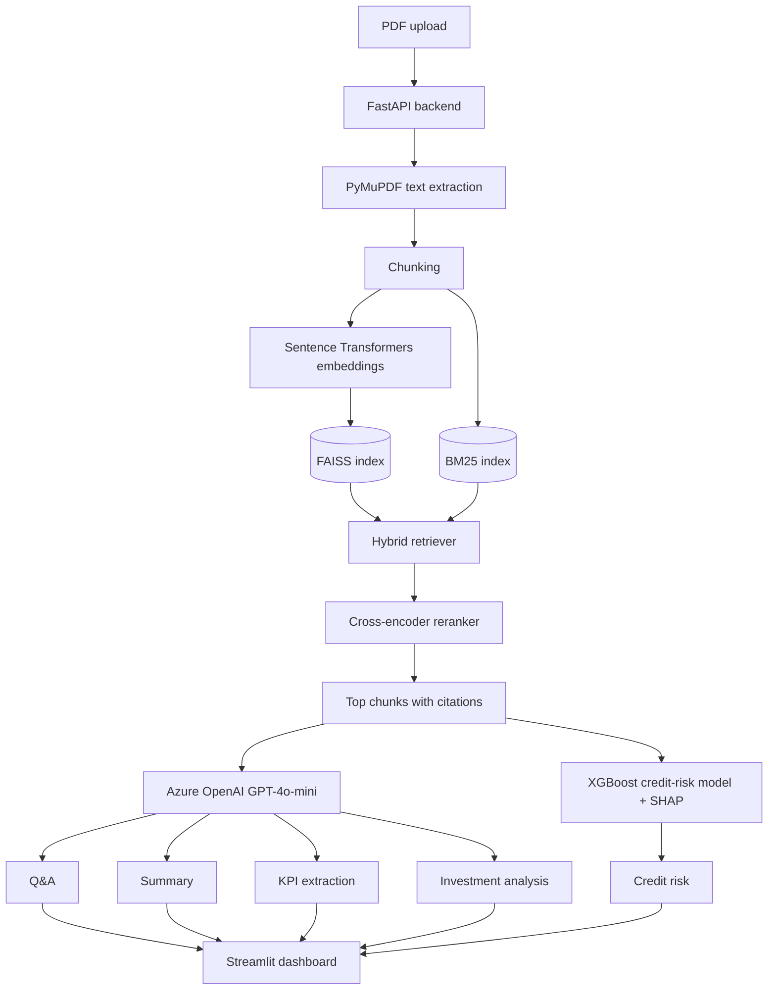
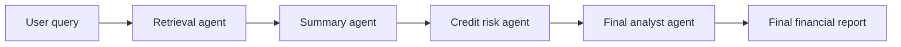

# FinSight AI: Financial Intelligence Copilot


FinSight AI reads annual reports and other financial PDFs, answers questions with source citations, extracts KPIs, and produces analyst-style reports with an explainable credit-risk view. It is built for analysts, bankers, auditors, NBFCs and credit-risk teams who need answers they can trace back to a page.

**Live demo:** [add your Azure Web App URL here, or remove this line]

## Demo

https://github.com/user-attachments/assets/fd5e49ce-0fd8-449d-a88a-6fe1d004b5cf

## What it does

| Capability | How |
| --- | --- |
| Source-grounded Q&A | Hybrid retrieval (FAISS + BM25) with cross-encoder reranking and page-level citations |
| Financial summary | LLM summary over retrieved sections of the report |
| KPI extraction | Pulls key ratios and figures into a dashboard |
| Credit risk | XGBoost risk model with SHAP explanations, combined with an LLM risk narrative |
| Investment insights | LLM analysis built on the retrieved evidence |
| Agentic report | LangGraph workflow that chains retrieval, summary, credit risk and a final analyst step |

## Architecture

### Retrieval and analysis pipeline


```mermaid
flowchart TD
    A[PDF upload] --> B[FastAPI backend]
    B --> C[PyMuPDF text extraction]
    C --> D[Chunking]
    D --> E[Sentence Transformers embeddings]
    E --> F[(FAISS index)]
    D --> G[(BM25 index)]
    F --> H[Hybrid retriever]
    G --> H
    H --> I[Cross-encoder reranker]
    I --> J[Top chunks with citations]
    J --> K[Azure OpenAI GPT-4o-mini]
    K --> L[Q&A]
    K --> M[Summary]
    K --> N[KPI extraction]
    K --> O[Investment analysis]
    J --> P[XGBoost credit-risk model + SHAP]
    P --> Q[Credit risk]
    L --> R[Streamlit dashboard]
    M --> R
    N --> R
    O --> R
    Q --> R
```

### LangGraph agent workflow


```mermaid
flowchart LR
    A[User query] --> B[Retrieval agent]
    B --> C[Summary agent]
    C --> D[Credit risk agent]
    D --> E[Final analyst agent]
    E --> F[Final financial report]
```

## Design decisions

**Why hybrid retrieval.** Financial documents mix meaning-based questions ("what does the company say about liquidity risk?") with exact-term lookups ("Gross NPA ratio", a specific year). Dense search handles the first well and blurs the second. BM25 covers exact terms, so the two are combined.
[Add one line on how you merge scores, for example weighted scores or rank fusion.]

**Why a reranker.** The retriever returns a broad candidate set. A cross-encoder ([model name]) rescoring the query and each chunk together puts the most relevant chunks first before they reach the LLM.

**Why XGBoost and SHAP next to an LLM.** An LLM can describe risk but cannot show which inputs drove a score. The XGBoost model gives a numeric risk output and SHAP shows which features pushed it up or down, so a reviewer can check the reasoning.

## Credit risk model

- **Target and features:** [describe what the model predicts and the main input features]
- **Data:** [dataset name or source, and whether it is synthetic or public]
- **Result:** [metric such as AUC or F1 on a held-out set]
- **Explainability:** SHAP values per prediction, shown in the dashboard as [summary plot or feature contribution chart]

## Evaluation

The RAG pipeline is evaluated with RAGAS, LangSmith tracing and an LLM-as-judge check.

| Metric | Result |
| --- | --- |
| Faithfulness | [value] |
| Answer relevancy | [value] |
| Context recall | [value] |

Test set: [number of questions] questions over [which public reports]. [Add one honest sentence about where it still fails, for example tables split across chunks.]

## Tech stack

| Layer | Technology |
| --- | --- |
| Frontend | Streamlit |
| Backend | FastAPI, Python 3.11 |
| LLM | Azure OpenAI GPT-4o-mini |
| Retrieval | FAISS, BM25, Sentence Transformers, cross-encoder reranker |
| Agents | LangGraph |
| Credit risk | XGBoost, SHAP, Scikit-Learn |
| Evaluation | RAGAS, LangSmith |
| PDF processing | PyMuPDF |
| Deployment | Docker, Docker Compose |

## Quick start

### Option 1: Docker

```bash
git clone https://github.com/VivekMane57/finsight-ai.git
cd finsight-ai
```

Create a `.env` file in the project root:

```env
AZURE_OPENAI_API_KEY=your_key
AZURE_OPENAI_ENDPOINT=your_endpoint
AZURE_OPENAI_API_VERSION=2024-02-15-preview
AZURE_OPENAI_DEPLOYMENT=your_deployment_name
```

Build and run:

```bash
docker compose build --no-cache
docker compose up
```

- Frontend: http://localhost:8501
- API docs (Swagger): http://localhost:8000/docs

Stop with `docker compose down`.

### Option 2: Local

```bash
python -m venv venv
venv\Scripts\activate        # Windows
# source venv/bin/activate   # macOS / Linux
pip install -r requirements.txt
```

Add the same `.env` file, then run the backend and frontend in two terminals:

```bash
uvicorn backend.app.main:app --reload
```

```bash
python -m streamlit run frontend/app.py
```

## API endpoints

| Method | Endpoint | Purpose |
| --- | --- | --- |
| POST | `/documents/upload` | Upload and index a document |
| POST | `/chat/query` | Source-grounded financial Q&A |
| POST | `/analysis/financial-summary` | Financial summary |
| POST | `/analysis/credit-risk` | Credit risk analysis |
| GET | `/kpi/financial-kpis` | KPI extraction |
| POST | `/agents/financial-intelligence` | Full agentic report |
| POST | `/analysis/investment-analysis` | Investment analysis |

## Project structure

```text
finsight-ai/
├── backend/
│   └── app/
│       ├── api/
│       │   ├── documents.py
│       │   ├── chat.py
│       │   ├── analysis.py
│       │   ├── kpi.py
│       │   ├── agents.py
│       │   └── investment.py
│       ├── services/
│       │   ├── document_processor.py
│       │   ├── chunking.py
│       │   ├── embedding_service.py
│       │   ├── faiss_store.py
│       │   ├── bm25_store.py
│       │   ├── search_service.py
│       │   └── llm_service.py
│       ├── agents/
│       │   ├── financial_graph.py
│       │   └── investment_agent.py
│       └── main.py
├── frontend/
│   └── app.py
├── uploads/
├── vectorstore/
├── Dockerfile
├── docker-compose.yml
├── requirements.txt
└── README.md
```

[Add the files for the credit-risk model and the evaluation scripts to this tree.]

## Roadmap

- PostgreSQL for persistent storage
- JWT authentication
- Chat history
- PDF report export
- Multi-company comparison
- Fraud detection agent

## Disclaimer

This project is for educational and portfolio purposes only. It does not provide financial advice.
